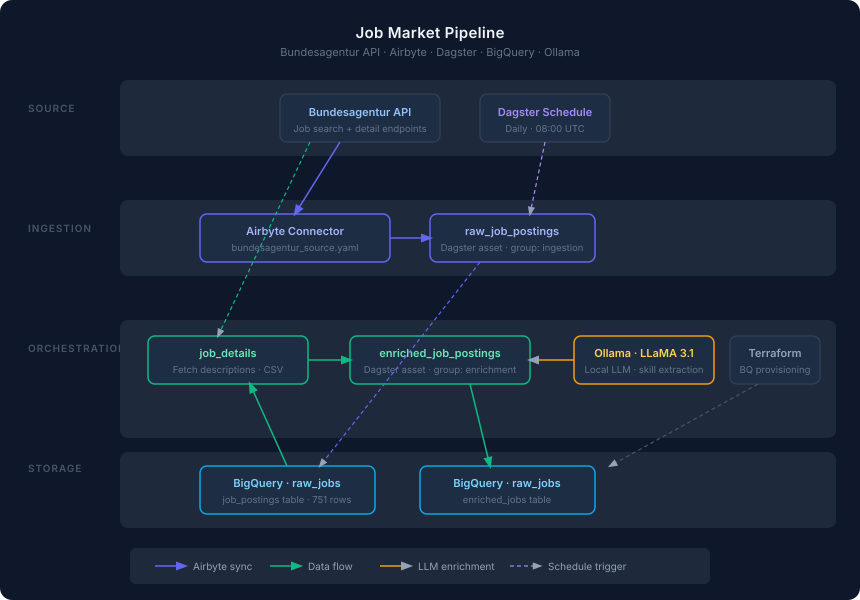

# Job Market Pipeline

A data pipeline that collects German job postings from the Bundesagentur für Arbeit API, stores them in BigQuery, and enriches them with LLM-extracted skills using a local Ollama model.

Built to practice working with Airbyte, Dagster, BigQuery, and Terraform together as a cohesive stack.

## Stack

| Layer | Tool |
|---|---|
| Ingestion | Airbyte (low-code connector) |
| Orchestration | Dagster |
| Storage | Google BigQuery |
| Infrastructure | Terraform |
| LLM Enrichment | Ollama · LLaMA 3.1 8B |

## Pipeline

```
Bundesagentur API
      │
      ▼
   Airbyte ──────────────► BigQuery (raw_jobs.job_postings)
      │                          │
      │ (Dagster: raw_job_postings)
                                 │
                    Dagster: job_details
                                 │
                    Fetches full descriptions
                    from Bundesagentur API
                                 │
                    Dagster: enriched_job_postings
                                 │
                          Ollama (local LLM)
                                 │
                                 ▼
                    BigQuery (raw_jobs.enriched_jobs)
```

The pipeline runs on a daily schedule (08:00 UTC) or can be triggered manually.



## Project Structure

```
.
├── airbyte/
│   └── bundesagentur_source.yaml   # Airbyte low-code connector manifest
├── dagsters/
│   ├── assets/
│   │   ├── raw_jobs.py             # Triggers Airbyte sync
│   │   ├── job_details.py          # Fetches full job descriptions
│   │   └── enriched_jobs.py        # LLM enrichment asset
│   ├── jobs/pipeline_job.py
│   ├── schedules/daily_schedule.py
│   ├── resources.py
│   └── definitions.py
├── src/
│   ├── config.py                   # Env-based config (frozen dataclass)
│   ├── fetch_job_details.py        # Bundesagentur detail API client
│   ├── enrich_jobs.py              # Ollama enrichment logic
│   └── logger.py
├── terraform/                      # BigQuery dataset + table provisioning
├── setup.sh                        # One-time setup script
├── run.sh                          # Pipeline trigger script
└── .env.example
```

## Prerequisites

- Python 3.11+
- [Terraform](https://developer.hashicorp.com/terraform/install)
- [Docker Desktop](https://www.docker.com/products/docker-desktop/)
- [abctl](https://github.com/airbytehq/abctl) — `brew install airbytehq/tap/abctl`
- [Ollama](https://ollama.com) with LLaMA 3.1 pulled: `ollama pull llama3.1:8b`
- A GCP project with BigQuery API enabled and a service account JSON key

## Setup

**1. Configure environment**

```bash
cp .env.example .env
# Fill in your GCP credentials, project ID, and Airbyte details
```

**2. Run setup** (one-time)

```bash
./setup.sh
```

This provisions BigQuery via Terraform, installs Python dependencies, and starts Airbyte.

**3. Configure Airbyte** (manual, one-time)

After `setup.sh` completes:

1. Open http://localhost:8000 and log in (`abctl local credentials`)
2. Create a source — Custom connector → paste `airbyte/bundesagentur_source.yaml`
3. Create a BigQuery destination using your service account JSON
4. Create a connection between source and destination
5. Copy the connection UUID from the URL into `.env` as `AIRBYTE_CONNECTION_ID`

## Running the Pipeline

```bash
./run.sh
```

Or open the Dagster UI to trigger and monitor runs:

```bash
dagster dev -m dagsters.definitions
# → http://localhost:3000
```

## License

[MIT](LICENSE)

## Environment Variables

See `.env.example` for all required variables. Key ones:

| Variable | Description |
|---|---|
| `GOOGLE_APPLICATION_CREDENTIALS` | Path to GCP service account JSON |
| `GCP_PROJECT_ID` | GCP project ID |
| `AIRBYTE_CONNECTION_ID` | UUID of the Airbyte connection |
| `AIRBYTE_USERNAME` / `AIRBYTE_PASSWORD` | From `abctl local credentials` |
